# 🚀 SaaSCommand 360 — SaaS Product, Revenue & Customer Success Analytics

> **Enterprise Analytics Engineering Capstone Platform**  
> *Combining product usage, subscriptions, billing, payments, and customer support into an intelligent, automated SaaS command center.*

[](https://opensource.org/licenses/MIT)
[](https://python.org)
[](https://fastapi.tiangolo.com)
[](https://react.dev)
[](https://duckdb.org)
[](#-zero-cloud-cost-architecture)

---

## 📌 Executive Summary

Modern SaaS companies face a critical visibility gap: **product telemetry, subscription lifecycles, billing status, and customer support reside in disconnected silos.** A customer might be paying an enterprise tier while their product engagement is dropping precipitously—or a highly engaged account might be bottlenecked by an under-provisioned plan.

**SaaSCommand 360** solves this with an end-to-end, production-grade analytics platform that:
1. **Ingests real-time product events & batch operational data** through an idempotent streaming event bus.
2. **Governs data across Bronze ➔ Silver ➔ Gold Medallion layers** using high-performance columnar storage and Kimball dimensional modeling.
3. **Computes core SaaS metrics**: MRR, ARR, Net Dollar Retention, Logo/Revenue Churn, Expansion, DAU/MAU, and SLA compliance.
4. **Applies ML models** for Churn Risk scoring, Expansion propensity, Anomaly detection, and Revenue forecasting.
5. **Drives automated actions**: Instantly triggers CSM alerts, dunning workflows, and upsell recommendations with complete audit trails.
6. **Serves hardened APIs & an interactive web UI**: FastAPI backend with OpenAPI docs + React/Tailwind Customer 360 command center.

---

## 🏛️ High-Level System Architecture

```mermaid
flowchart LR
    subgraph Sources["1. Event Telemetry & Business Systems"]
        PE["Product Events\n(Usage Telemetry)"]
        SUB["Subscriptions\n(Contract Lifecycle)"]
        INV["Invoicing & Billing\n(Payment Gateway)"]
        SUP["Support Tickets\n(Service Desk)"]
    end

    subgraph Streaming["2. Real-Time Streaming & Bus"]
        EB["Event Bus & Worker\n(Validation, Dedup, DLQ)"]
    end

    subgraph Lakehouse["3. Medallion Data Warehouse"]
        Bronze[("Bronze Layer\n(Raw Immutable)")]
        Silver[("Silver Layer\n(Cleansed, Typed)")]
        Gold[("Gold Marts\n(Kimball Star Schema)")]
    end

    subgraph Intelligence["4. ML & Automation Engine"]
        ML["ML Intelligence\n(Churn, Expansion, Anomaly, ARR Forecast)"]
        Dec["Decision Engine\n(Alerts, Escalations, Webhooks)"]
    end

    subgraph Presentation["5. Serving & UI"]
        API["FastAPI REST Engine\n(OpenAPI, Auth, 11+ Endpoints)"]
        UI["React Command Center\n(Customer 360, Revenue, Health)"]
    end

    Sources --> EB
    EB --> Bronze
    Bronze --> Silver --> Gold
    Gold --> ML
    Gold --> Dec
    ML --> Dec
    Gold --> API
    Dec --> API
    API --> UI
```



---

## 💡 Zero Cloud Cost Architecture

Designed to run **100% locally or on free-tier container hosting** with zero subscription or cloud warehouse fees:
- **Warehouse**: Embedded **DuckDB** + **SQLite** (blazing-fast columnar OLAP without Snowflake/BigQuery charges).
- **Streaming**: Lightweight in-memory / disk-backed **Event Bus** with Kafka-compatible producer/consumer interfaces, retries, idempotency, and Dead-Letter Queues (DLQ).
- **Machine Learning**: Native **scikit-learn** and **NumPy/Pandas** feature engineering and inference.
- **Backend & Frontend**: Standard open-source **FastAPI** + **React/Vite** stack.

---

## 📂 Project Repository Structure

```
SaaSCommands360/
├── backend/                  # FastAPI Application & REST Endpoints
│   ├── app/
│   │   ├── api/              # Route handlers (revenue, health, ML, alerts)
│   │   ├── core/             # Configuration, security & database sessions
│   │   ├── models/           # Pydantic & ORM schemas
│   │   ├── services/         # Analytics, ML inference, and automation engine
│   │   └── main.py           # Application entrypoint
│   └── tests/                # Automated pytest suite
├── data/                     # Data Lake & Synthetic Generator
│   ├── raw/                  # Bronze raw JSON storage
│   ├── processed/            # Silver parquet/sqlite tables
│   └── generator.py          # Enterprise SaaS realistic event generator
├── warehouse/                # Medallion Lakehouse & dbt models
│   ├── schema.sql            # Star schema DDL definitions
│   └── pipeline.py           # Medallion ETL pipeline (Bronze -> Silver -> Gold)
├── streaming/                # Streaming Event Bus & Consumers
│   ├── event_bus.py          # Kafka-style bus with DLQ & deduplication
│   ├── producer.py           # Real-time event telemetry producer
│   └── consumer.py           # Stream processor & health re-calculator
├── ml/                       # Machine Learning & Forecasting Models
│   ├── churn_model.py        # Churn risk scoring classifier
│   ├── expansion_model.py    # Expansion / upsell propensity scoring
│   ├── anomaly_detection.py  # Usage anomaly detection (Z-Score & Isolation)
│   └── revenue_forecast.py   # ARR / MRR time-series forecasting
├── decision_engine/          # Automated Rules & Notification Engine
│   └── rules.py              # Domain rules (CSM alert, payment failure, upsell)
├── orchestration/            # Workflow DAGs & Scheduler
│   └── scheduler.py          # Lightweight pipeline scheduler with run audit log
├── frontend/                 # React + Tailwind CSS Dashboard
│   ├── src/
│   │   ├── pages/            # Customer 360, Revenue, Health, Alerts, Simulator
│   │   ├── components/       # KPI cards, charts, data grids
│   │   └── App.jsx           # Main UI container
│   └── package.json
├── docker/                   # Containerization
│   ├── Dockerfile.backend
│   ├── Dockerfile.frontend
│   └── docker-compose.yml
├── docs/                     # Complete Capstone Documentation
│   ├── ARCHITECTURE.md       # High-level architecture & pipeline flow
│   ├── ERD_SCHEMA.md         # ERD and Kimball dimensional model
│   ├── DATA_DICTIONARY.md    # Field-level dictionary
│   ├── CLOUD_DEPLOYMENT_AND_COST.md # Deployment & cost breakdown
│   └── TECHNICAL_INTERVIEW_PREP.md  # 12 Technical interview questions & answers
└── README.md
```

---

## 🚦 Git Phase Milestones & Commits

This project is built and committed systematically across clean phases:

- **Phase 1: Architecture, Scaffolding & Documentation** *(Completed)*
- **Phase 2: Ingestion & Medallion Data Warehouse** *(Next)*
- **Phase 3: Real-Time Event Streaming & Data Quality Engine**
- **Phase 4: ML Intelligence & Automated Decision Engine**
- **Phase 5: FastAPI REST Backend Engine (Section 12 Spec)**
- **Phase 6: Modern React / Tailwind Command Center Frontend**
- **Phase 7: Orchestration, Testing, Docker & GitHub CI/CD**

---

## ⚡ Quick Start (Local Run)

### 1. Backend & Data Pipeline
```bash
# Clone or navigate to the repository
cd C:\SaaSCommands360

# Install dependencies
python -m pip install -r backend/requirements.txt

# Run pipeline (generate data, populate warehouse, train ML)
python data/generator.py
python warehouse/pipeline.py

# Launch FastAPI server
python -m uvicorn backend.app.main:app --reload --port 8000
```
*API & OpenAPI Swagger docs available at `http://localhost:8000/docs`.*

### 2. Frontend Command Center
```bash
cd frontend
npm install
npm run dev
```
*Web UI available at `http://localhost:5173`.*
