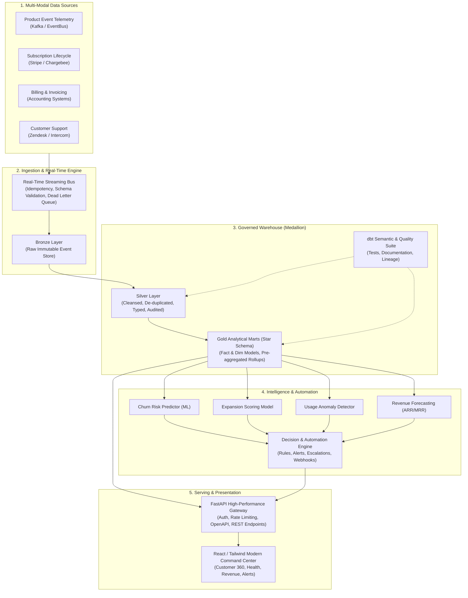

# SaaSCommand 360 — Architecture & System Design

## 1. Executive Summary
**SaaSCommand 360** is an enterprise-grade analytics engineering and customer intelligence command center. It bridges product telemetry, customer success, subscription lifecycles, and billing pipelines into a unified real-time and batch analytical ecosystem.

---

## 2. High-Level End-to-End Architecture

---

## 3. Data Lakehouse & Medallion Design

### Bronze Layer (Raw & Immutable)
- Ingests raw events with complete payload integrity.
- Adds metadata audit columns: `_ingested_at`, `_source_channel`, `_raw_payload_hash`.
- Append-only storage format.

### Silver Layer (Cleansed & Conformed)
- Schema enforcement & null checking.
- Deduplication using event business keys (`event_id`, `invoice_id`, `ticket_id`).
- Timestamps standardized to UTC ISO-8601.
- Referential integrity checks between users, accounts, and subscriptions.

### Gold Layer (Dimensional Marts)
- Modeled as an Kimball-style Star Schema.
- Dimension Tables: `dim_account`, `dim_user`, `dim_product_feature`, `dim_date`, `dim_plan`.
- Fact Tables: `fact_usage`, `fact_billing`, `fact_support`, `fact_subscription`.
- Pre-aggregated snapshot tables for high-performance dashboard queries:
  - `mrt_customer_health_daily`
  - `mrt_mrr_movements`
  - `mrt_feature_adoption_weekly`

---

## 4. Analytical Metrics & Semantic Layer (Section 8)

1. **Monthly Recurring Revenue (MRR)**: Sum of active normalized monthly subscription values.
2. **Annual Recurring Revenue (ARR)**: $MRR \times 12$.
3. **Logo Churn Rate**: $\frac{\text{Churned Accounts during Period}}{\text{Total Active Accounts at Start of Period}} \times 100\%$.
4. **Net Revenue Churn Rate**: $\frac{\text{Churned ARR} - \text{Expansion ARR}}{\text{Beginning ARR}} \times 100\%$.
5. **Expansion ARR**: Increase in recurring revenue from existing customers (upgrades, additional seats, tier changes).
6. **Contraction ARR**: Decrease in recurring revenue from downgrades without full churn.
7. **DAU / MAU Ratio**: Product stickiness ratio ($\frac{\text{Daily Active Users}}{\text{Monthly Active Users}}$).
8. **Feature Adoption Index**: Percentage of active accounts utilizing core and advanced features within 30 days.
9. **Support SLA Breach Rate**: Ratio of tickets exceeding first-response or resolution SLAs.

---

## 5. Machine Learning & Predictive Modeling (Section 9)

- **Churn Risk Classifier**: Random Forest / Logistic Regression model trained on usage trajectory, support frequency, billing delays, and login decay to compute a churn probability $[0, 1]$.
- **Expansion Opportunity Scorer**: Propensity model identifying high-usage accounts nearing plan limits or displaying enterprise feature affinity.
- **Usage Anomaly Detection**: Statistical Z-Score / Isolation Forest tracking unexpected drops or spikes in event volume per account.
- **Revenue Forecasting**: Time-series exponential smoothing & linear trend regression predicting ARR/MRR for the upcoming quarters.

---

## 6. Automation & Decision Engine (Section 10)

| Trigger Event | Evaluation Criteria | Automated Action | Target Channel |
| :--- | :--- | :--- | :--- |
| **Health Drop** | Health score drops below 50 or drops $> 20\%$ week-over-week | Generate High-Severity CSM Alert, create retention task | Slack / Webhook / In-App |
| **Payment Failure** | Invoice status transitions to `failed` | Trigger automated dunning sequence, mark billing alert | Email / Webhook |
| **Adoption Threshold** | Feature usage $> 85\%$ of plan quota | Trigger Upsell Opportunity recommendation to Account Executive | Slack / CRM sync |
| **Support Deterioration** | $> 3$ Critical tickets unresolved in 48 hours | Escalate to VP of Customer Success & Technical Lead | Teams / PagerDuty / In-App |

All triggers generate immutable audit logs with `alert_id`, `account_id`, `severity`, `trigger_reason`, `timestamp`, `status`, and `audit_history`.

---

## 7. Security, Governance & Observability

- **Authentication & RBAC**: JWT Bearer token authentication supporting `admin`, `analyst`, and `csm` roles.
- **Data Governance**: Synthetic data generator ensuring zero PII exposure in development and demos.
- **Data Quality Framework**: Automated pre-ingestion and post-transformation checks (uniqueness, referential integrity, range constraints).
- **Observability**: Structured JSON logging, health-check endpoints, pipeline run monitors, and execution audit trails.
