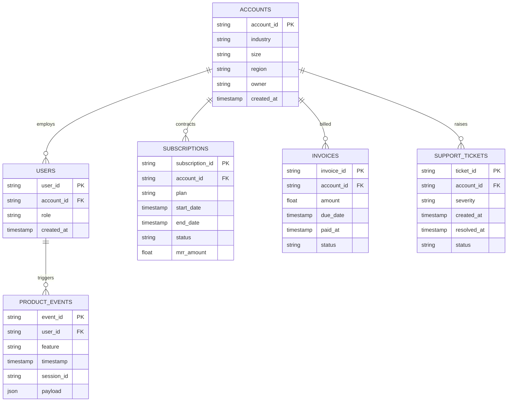
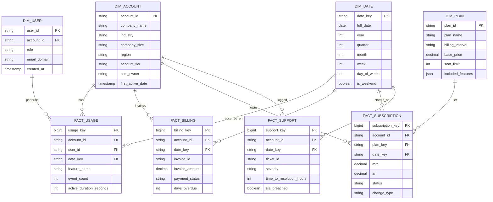

# SaaSCommand 360 — Entity-Relationship Diagram (ERD) & Star Schema

## 1. Entity-Relationship Conceptual Model

The transactional and telemetry models capture user activity, subscription states, invoices, and customer support.

---

## 2. Kimball Dimensional Star Schema (Gold Warehouse Marts)

For analytical queries, BI, and ML feature stores, data is modeled into dimension and fact tables:

---

## 3. Pre-Aggregated Analytical Data Marts

### `mrt_customer_health_daily`
- Grain: `account_id` + `date_key`
- Metrics:
  - `health_score` (0-100 calculated index)
  - `churn_risk_score` (ML output probability)
  - `active_users_7d`, `active_users_30d`
  - `total_events_7d`, `event_growth_wow`
  - `open_tickets_count`, `unresolved_p1_tickets`
  - `payment_status` (`current`, `overdue`, `grace_period`)

### `mrt_mrr_movements`
- Grain: `date_key` + `account_id`
- Metrics:
  - `beginning_mrr`, `new_mrr`, `expansion_mrr`, `contraction_mrr`, `churn_mrr`, `ending_mrr`
  - Net New MRR = $(New + Expansion) - (Contraction + Churn)$
